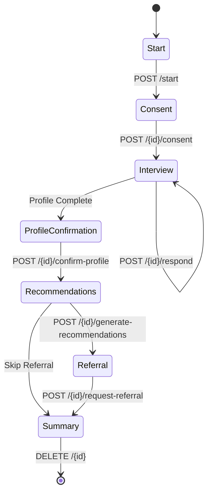

# Frontend API Handoff Document

## Backend Overview
JeevanMitra 2.0 backend provides RESTful APIs for managing user journeys, recommendations, consent, and interviews. The architecture includes modular routers for specific domains (Journey, Consent, Recommendations, etc.). Authentication involves session/beneficiary IDs or actor tokens.

## Standard Error Response
All API errors follow a standardized JSON format:
```json
{
  "detail": "Error description or specific validation message"
}
```
HTTP status codes are used appropriately:
- `400 Bad Request`: Validation errors or invalid state transitions.
- `401 Unauthorized`: Missing or invalid authentication.
- `403 Forbidden`: Insufficient permissions.
- `404 Not Found`: Resource does not exist.
- `422 Unprocessable Entity`: Schema validation errors.
- `500 Internal Server Error`: Unexpected system failure.

## Journey API Contract
The Journey API (`/api/v1/journey`) encapsulates the flow of a user through the system. 
Base path: `/api/v1/journey`

- `POST /start`: Initiates a new journey session. Returns `JourneyResponse`.
- `POST /{journey_id}/consent`: Updates user consent during the journey.
- `POST /{journey_id}/respond`: Submits user response (audio/text) to the interview.
- `GET /{journey_id}`: Retrieves the current state of the journey.
- `POST /{journey_id}/confirm-profile`: Confirms the user profile extracted so far.
- `POST /{journey_id}/generate-recommendations`: Triggers the recommendation engine.
- `POST /{journey_id}/request-referral`: Submits a referral request.
- `POST /{journey_id}/summary`: Fetches a summary of the journey.
- `DELETE /{journey_id}`: Deletes the journey and associated data.

## Journey-state Diagram


## Recommendation Response Rules
The recommendation engine (`/recommendations/generate`) returns a structured list of recommendations based on the confirmed profile and verified catalog. 
Rules:
- Requires an active `journey_id` or `session_id`.
- Returns deterministic matches based on qualification rules.
- Legacy endpoint (`/recommendations/match`) provides backward compatibility.

## Consent, Privacy, and Deletion Behavior
- **Consent (`/consents`)**: Explicit consent is recorded for data processing, DPDP compliance, etc. Consent can be revoked (`/{consent_id}/revoke`), halting processing immediately.
- **Privacy**: Anonymous sessions are supported. Personally Identifiable Information (PII) is encrypted or handled according to DPDP guidelines.
- **Deletion (`DELETE /api/v1/journey/{journey_id}`)**: Purges session data, interview turns, and PII. Aggregate anonymized data may be retained if consent for analytics was provided.
