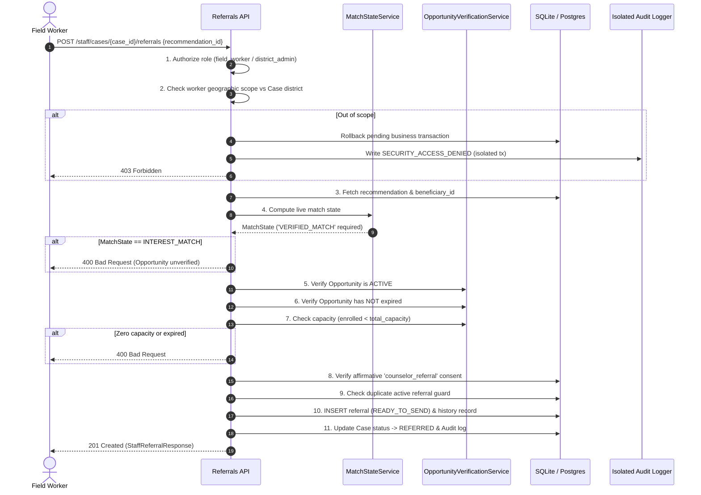
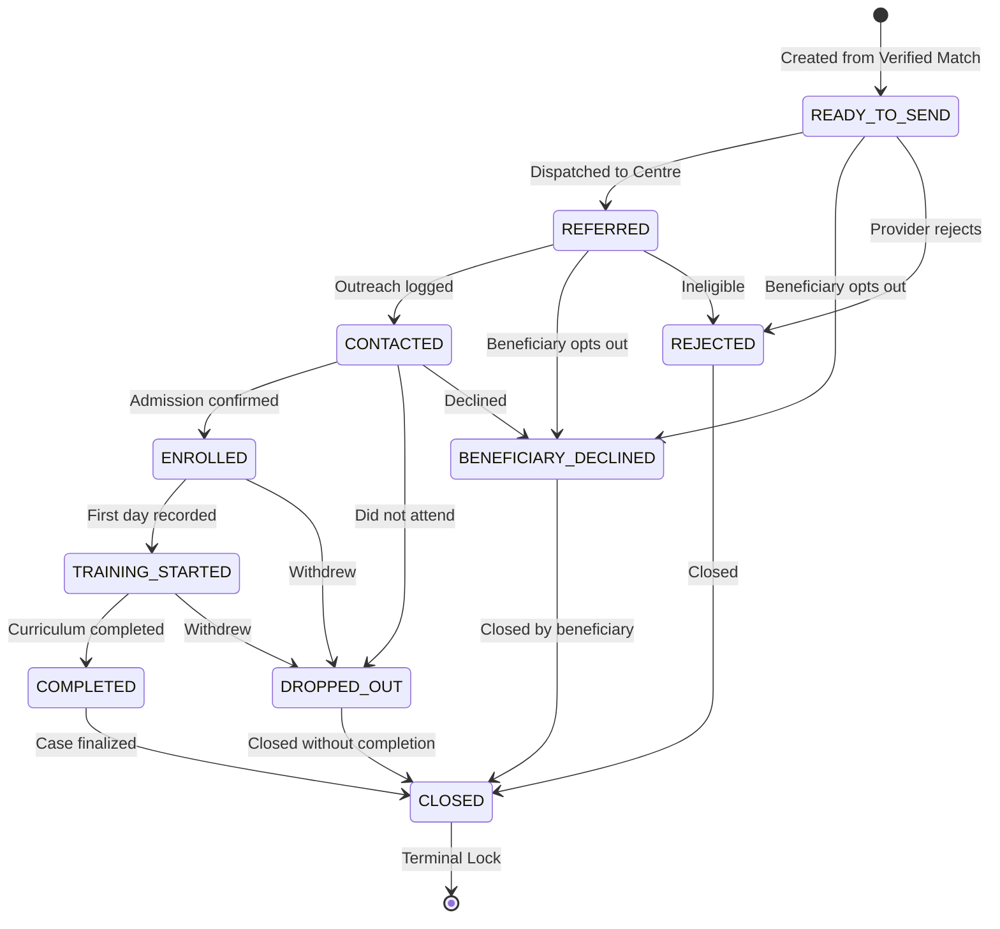

# Sprint 5 — Field-Worker Case Management, Referrals, Follow-Up, and Outcomes

## 1. System Overview & Core Trust Invariant

JeevanMitra 2.0 enforces a foundational guarantee across all skilling and livelihood services under PM-AJAY:
> **Core Guarantee**: A referral can **ONLY** be created from a currently valid `VERIFIED_MATCH` linked to an `ACTIVE`, non-expired, capacity-available local opportunity within the field worker's and beneficiary's assigned geographic scope, backed by affirmative DPDP-compliant consent.

Under no circumstances can an `INTEREST_MATCH` (which lacks confirmed local batch verification) be converted into an active referral, and no client request may supply arbitrary foreign keys or bypass server-side validation.

---

## 2. 11-Step Atomic Referral Creation Transaction

When `POST /api/v1/staff/cases/{case_id}/referrals` (or legacy `POST /api/v1/referrals`) is invoked, the backend executes the following atomic sequence within an ACID transaction:

---

## 3. Referral State Machine

Referrals progress through strict, unidirectional state transitions. Invalid transitions are rejected with HTTP 400. Once a referral reaches a terminal state (`CLOSED`), it is locked against further mutations.

### Transition Permission Matrix

| Current State | Allowed Next States | Triggered By |
|---|---|---|
| `READY_TO_SEND` | `REFERRED`, `BENEFICIARY_DECLINED`, `REJECTED` | Field Worker / Beneficiary |
| `REFERRED` | `CONTACTED`, `BENEFICIARY_DECLINED`, `REJECTED` | Field Worker / Beneficiary |
| `CONTACTED` | `ENROLLED`, `DROPPED_OUT`, `BENEFICIARY_DECLINED`, `REJECTED` | Field Worker / Beneficiary |
| `ENROLLED` | `TRAINING_STARTED`, `DROPPED_OUT` | Field Worker |
| `TRAINING_STARTED` | `COMPLETED`, `DROPPED_OUT` | Field Worker |
| `COMPLETED` | `CLOSED` | Supervisor / Admin |
| `DROPPED_OUT` | `CLOSED` | Field Worker / Admin |
| `REJECTED` | `CLOSED` | Field Worker / Admin |
| `BENEFICIARY_DECLINED` | `CLOSED` | Field Worker / Admin |
| `CLOSED` | *(None - Terminal Lock)* | N/A |

---

## 4. Privacy & Data Isolation Boundary

To protect beneficiary confidentiality while empowering field staff, strict view segregation is enforced:

| Field / Asset | Staff Portal (`/staff/*`) | Beneficiary View (`/me/*`) | Reason |
|---|---|---|---|
| Opportunity Title & Provider Name | Visible | Visible | Public batch information |
| Eligibility & Match State | Visible | Visible | High-level status |
| Field Worker Internal Notes (`is_staff_only=1`) | Visible | **OMITTED** | Internal social worker casework |
| Provider Private Contact Details | Visible | **OMITTED** | Spam/harassment prevention |
| Eligibility Criteria Snapshot | Visible | **OMITTED** | Internal evaluation details |
| Status Representations | Technical enum (`TRAINING_STARTED`) | Bilingual localized string | Clear user comprehension |

### Bilingual Status Parity (`en` / `hi`)

| Technical Status | English Title | English Description | Hindi Title | Hindi Description |
|---|---|---|---|---|
| `READY_TO_SEND` | Referral Initiated | Your referral has been prepared and is being submitted to the local training provider. | रेफरल प्रारंभ हुआ | आपका रेफरल तैयार हो गया है और स्थानीय प्रशिक्षण प्रदाता को भेजा जा रहा है। |
| `REFERRED` | Application Submitted | Application has been sent to the training centre. A field worker will coordinate the next step. | आवेदन प्रस्तुत किया गया | आवेदन प्रशिक्षण केंद्र को भेजा गया है। क्षेत्रीय कार्यकर्ता अगले चरण का समन्वय करेंगे। |
| `CONTACTED` | Field Worker Contacted You | The training provider or field worker has initiated contact to schedule enrolment. | संपर्क स्थापित हुआ | प्रशिक्षण प्रदाता या क्षेत्रीय कार्यकर्ता ने नामांकन के लिए आपसे संपर्क किया है। |
| `ENROLLED` | Enrolment Confirmed | You have been successfully enrolled in this training batch. | नामांकन पक्का हुआ | आपका इस प्रशिक्षण बैच में सफलतापूर्वक नामांकन हो गया है। |
| `TRAINING_STARTED` | Training in Progress | Your training classes are underway. Keep up the great work! | प्रशिक्षण प्रारंभ हुआ | आपका प्रशिक्षण शुरू हो गया है। नियमित उपस्थिति बनाए रखें। |
| `COMPLETED` | Training Completed | Congratulations! You have completed the training program. | प्रशिक्षण पूर्ण हुआ | बधाई हो! आपने अपना प्रशिक्षण कार्यक्रम सफलतापूर्वक पूर्ण कर लिया है। |
| `DROPPED_OUT` | Course Incomplete | Training participation ended before completion. Reach out to your field worker for alternatives. | अधूरा रहा | प्रशिक्षण पूरा नहीं हो सका। अन्य अवसरों के लिए अपने कार्यकर्ता से संपर्क करें। |
| `REJECTED` | Application Closed | This batch is no longer available. Your field worker will assist with alternative options. | आवेदन बंद हुआ | यह बैच अब उपलब्ध नहीं है। कार्यकर्ता वैकल्पिक विकल्पों में सहायता करेंगे। |
| `BENEFICIARY_DECLINED` | Offer Declined | You decided not to proceed with this opportunity. | अवसर अस्वीकार किया | आपने इस अवसर को आगे न बढ़ाने का निर्णय लिया। |
| `CLOSED` | Case Closed | This case has been successfully concluded. | मामला समाप्त | यह मामला पूर्ण रूप से समाप्त कर दिया गया है। |

---

## 5. Security & Scope Enforcement

1. **Role-Based Access Control**:
   - `staff/*` endpoints require `field_worker`, `district_admin`, or `super_admin` role.
   - `beneficiary` role attempting to call `/staff/*` receives HTTP 403.
   - `me/*` endpoints require authenticated `beneficiary` and strictly query `WHERE beneficiary_id = :authenticated_user_id`.

2. **Geographic Scoping**:
   - Every field worker has an assigned district (e.g. `Moradabad`).
   - Any attempt by worker `Beta` (district `Bareilly`) to access or refer a case in `Moradabad` triggers an immediate rollback of all pending business mutations, writes an audit record `SECURITY_ACCESS_DENIED` via an isolated transaction, and returns HTTP 403 Forbidden.

3. **Isolated Audit Logging**:
   - Denied access attempts are logged independently so business database state is never inadvertently committed before raising the 403.
