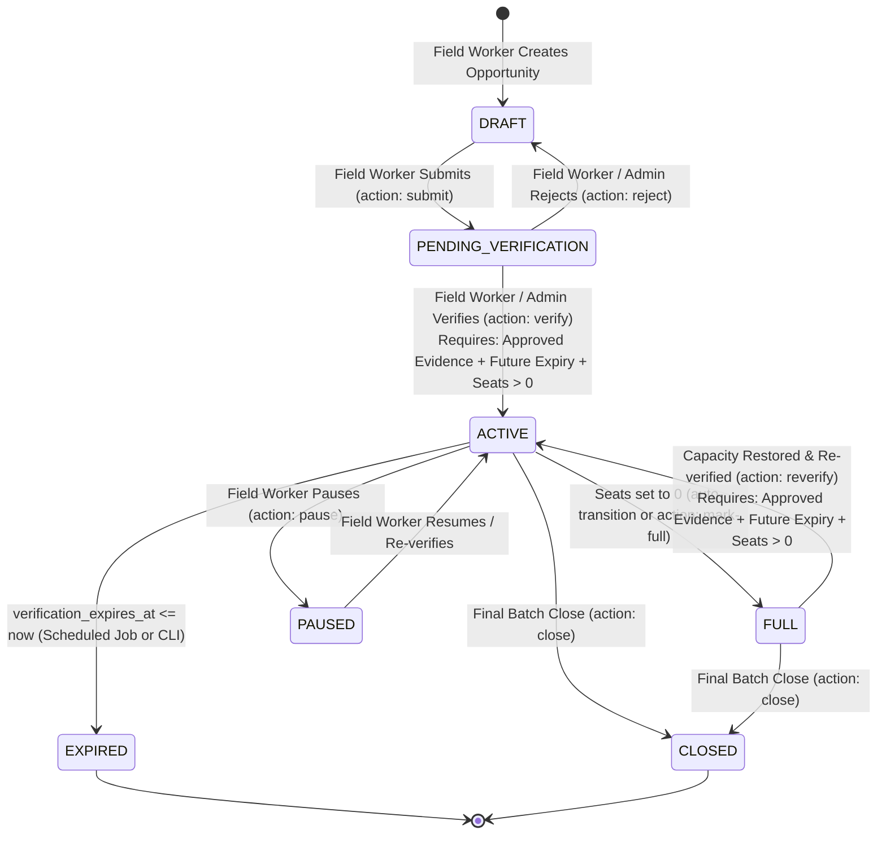

# Verified Opportunities & Verification Workflow

## 1. Core Architecture

JeevanMitra 2.0 maintains a strict separation between **verified national qualifications** (the *demand-neutral qualification pathways*) and **local opportunities** (the *confirmed, actionable seats, batches, or vacancies*).

---

## 2. Match State Semantics

The platform enforces two distinct match states across AI recommendations and opportunity queries:

| Match State | Trigger Condition | Referral Capability | Worker Support |
|---|---|---|---|
| **`INTEREST_MATCH`** | Qualification is verified (`verification_status = 'VERIFIED'`), but no active, non-expired local opportunity with available capacity exists in the beneficiary's geographic area. | `canRequestReferral = False` | `canRequestWorkerSupport = True` |
| **`VERIFIED_MATCH`** | Qualification is verified AND at least one local opportunity in the beneficiary's district/block has: `status = 'ACTIVE'`, `verification_expires_at > now()`, and `seats_available > 0` (or `vacancies_available > 0`). | `canRequestReferral = True` | `canRequestWorkerSupport = True` |

### Expiry Behavior: Dual Enforcement
1. **Read-Time Enforcement**:
   - `GET /api/v1/opportunities`: Returns opportunities where `status = 'ACTIVE'` AND `(verification_expires_at IS NULL OR verification_expires_at > now())`.
   - `GET /api/v1/opportunities/{id}`: Returns `404 Not Found` if `verification_expires_at <= now()`.
   - `GET /api/v1/opportunities/matches/{qualification_id}`: Evaluates `verification_expires_at > now()`. Expired opportunities degrade to `INTEREST_MATCH`.
2. **Scheduled Batch Enforcement**:
   - `OpportunityExpiryService.process_expiries(conn, dry_run=False)`:
     - Scans for `status = 'ACTIVE'` with `verification_expires_at <= now()`.
     - Transitions status to `EXPIRED`.
     - Appends lifecycle event `EXPIRED` in `opportunity_verification_events`.
     - Emits `OPPORTUNITY_EXPIRED` in `audit_events`.
     - Recalculates `recommendation_match_state` for linked beneficiaries.

---

## 3. Role-Based Access Control (RBAC) & Scope Matrix

| Role | Catalogue Routes (`/admin/qualifications`) | Opportunity Creation & Verification (`/staff/opportunities`) | Staff Detail & History Read | Audit Events (`/audit/events`) |
|---|---|---|---|---|
| `catalogue_manager` | **Full (Create, Update, Map Course)** | Forbidden (`403`) | Forbidden (`403`) | Forbidden (`403`) |
| `field_worker` | Forbidden (`403`) | **Allowed within assigned district/block** | **Allowed within assigned scope** | Forbidden (`403`) |
| `district_admin` | **Full** | **Allowed within assigned district** | **Allowed within district** | **Allowed (Read-Only)** |
| `auditor` | Read-only | Forbidden (`403`) | **Allowed (Read-Only within scope)** | **Allowed (Read-Only)** |
| `super_admin` | **Full (Global)** | **Full (Global)** | **Full (Global)** | **Full (Global)** |
| `beneficiary` | Read-only (`/qualifications` safe subset) | Forbidden (`403`) | Forbidden (`403`) | Forbidden (`403`) |

---

## 4. Geographic Scope Checks

Field workers and district staff have geographic assignments recorded in `user_scopes`:
- `district_id` (mandatory for localized staff)
- `block_id` (optional, for block-specific field workers)
- `scope_type` (`"district"` or `"block"`)

When attempting to read or mutate a local opportunity:
1. System loads actor's assigned scopes from `user_scopes`.
2. `super_admin` and `admin` bypass scope restrictions globally.
3. For field workers: if `opportunity.district_id != actor.district_id` or `opportunity.block_id != actor.block_id`, access is denied (`403 Forbidden`).
4. A security audit event (`SECURITY_ACCESS_DENIED`) is committed to `audit_events` with the target `entity_id` and `actor_user_id`.

---

## 5. Audit Logging Specifications

All operational and verification events are recorded in append-only tables:

1. **`opportunity_verification_events`**:
   - `id`: Event UUID
   - `opportunity_id`: FK to `local_opportunities`
   - `actor_user_id`: FK to `users`
   - `previous_status`: Prior status (e.g. `PENDING_VERIFICATION`)
   - `new_status`: Resulting status (e.g. `ACTIVE`)
   - `verification_action`: Action verb (`SUBMITTED`, `VERIFIED`, `REVERIFIED`, `MARKED_FULL`, `EXPIRED`, `CLOSED`)
   - `reason`: Justification text
   - `verification_expires_at`: Validity timestamp for verified statuses
   - `created_at`: Timestamp

2. **`audit_events`**:
   - `action`: `LOCAL_OPPORTUNITY_CREATED`, `LOCAL_OPPORTUNITY_UPDATED`, `OPPORTUNITY_EVIDENCE_ATTACHED`, `OPPORTUNITY_VERIFIED`, `OPPORTUNITY_REVERIFIED`, `OPPORTUNITY_MARKED_FULL`, `OPPORTUNITY_EXPIRED`, `SECURITY_ACCESS_DENIED`.
   - `actor_user_id`: Authenticated user ID.
   - `entity_type`: `local_opportunity`, `opportunity_evidence`, `opportunity_provider`.
   - `entity_id`: Record ID.
