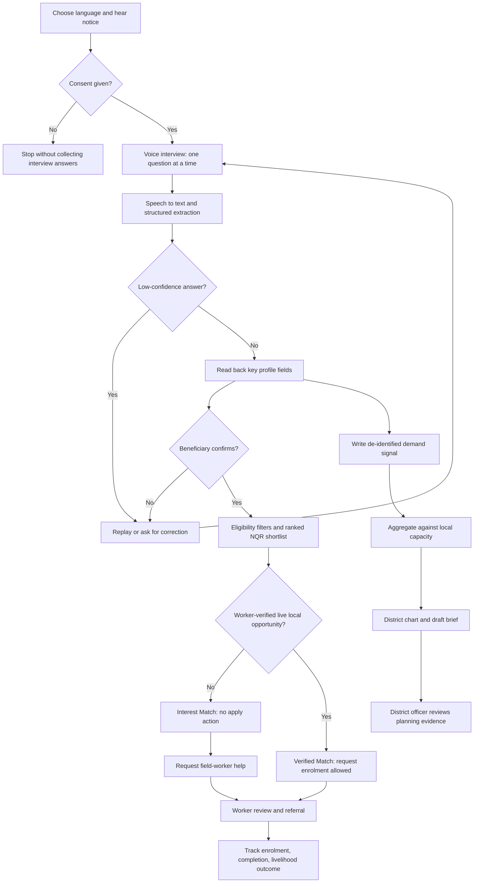
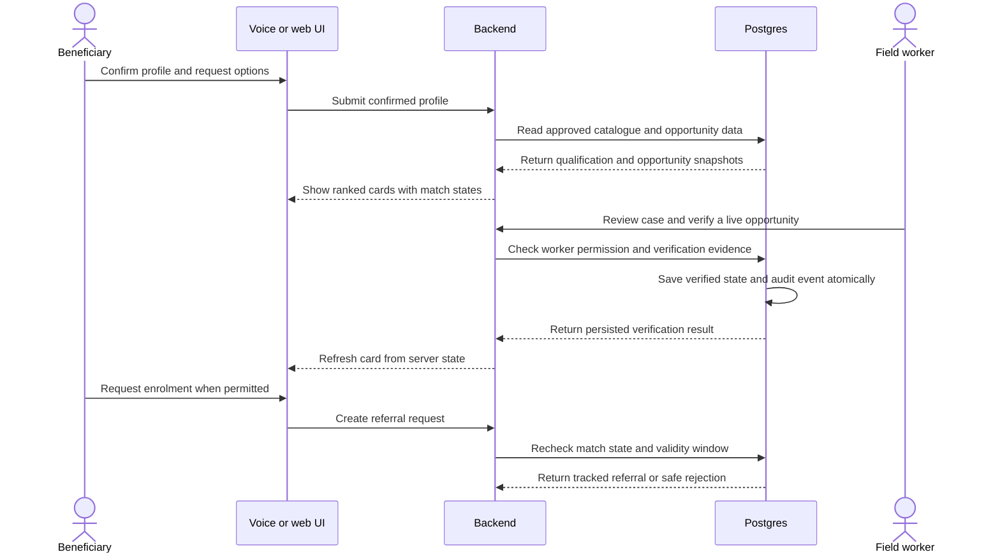
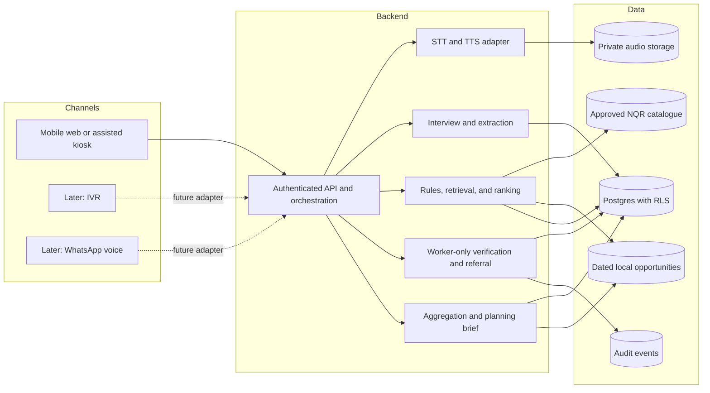
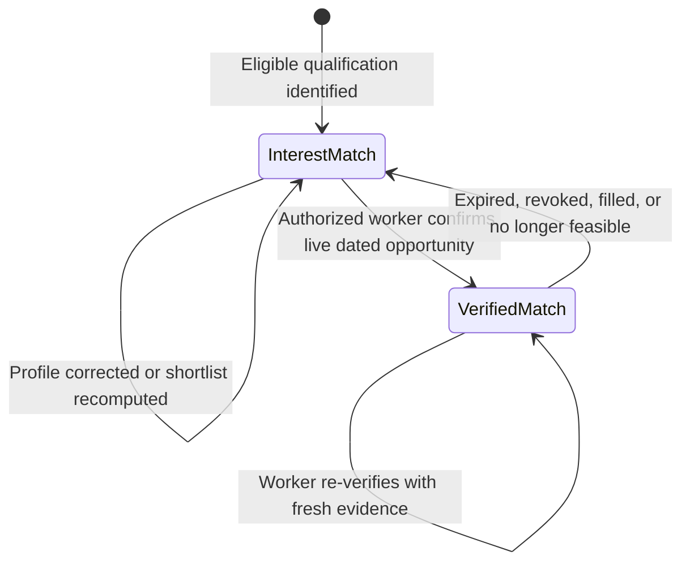
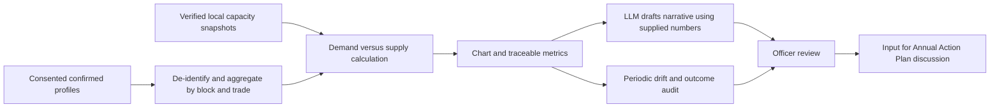
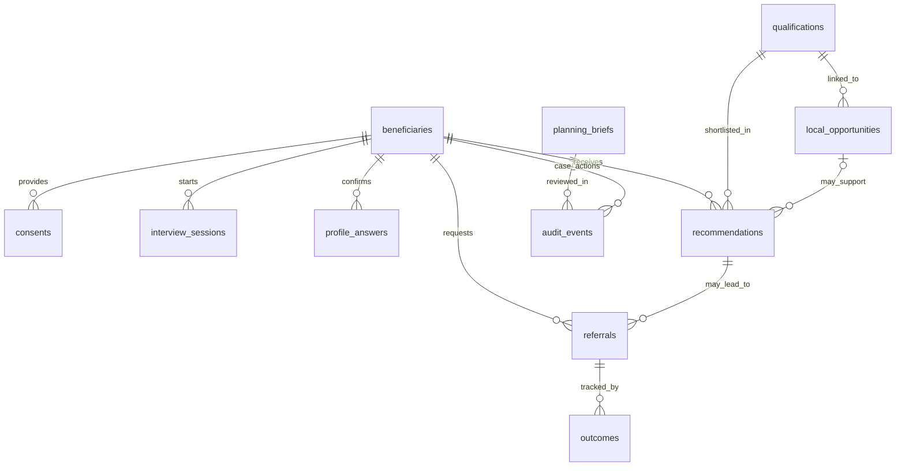

# JeevanMitra 2.0

> A verification-first, voice-led livelihood guidance and district planning system for Scheduled Caste beneficiaries under the Grant-in-Aid (GIA) component of PM-AJAY.

Project note: This repository is being actively updated for iterative improvements and validation.

**Status:** Solution/design draft. Implementation status is not confirmed; do not describe the architecture below as deployed or integrated with official systems.  
**Problem statement ID:** 26097  
**Source material studied:** `Problem-statement.pdf` and `JeevanMitra_2.0_Solution_Proposal.pdf` (supplied project documents).  
**Audience:** Product, design, AI, frontend, backend, and field-operations teammates.

**Run locally (WSL):** In one terminal, run `cd backend`, `python3 -m venv .venv`, `source .venv/bin/activate`, `python -m pip install -r requirements.txt`, then `python run.py` (set `AI_PROVIDER=mock` in `backend/.env` for keyless local use). In a second terminal, run `cd frontend`, `npx --yes pnpm@10 install`, then `npx --yes pnpm@10 dev`. Open `http://localhost:3000` for the UI or `http://localhost:4000/docs` for the API.

## Contents

1. [The problem](#the-problem)
2. [Our solution](#our-solution)
3. [Who uses it](#who-uses-it)
4. [End-to-end workflow](#end-to-end-workflow)
5. [System architecture](#system-architecture)
6. [The six AI layers](#the-six-ai-layers)
7. [Matching and verification](#matching-and-verification)
8. [District planning loop](#district-planning-loop)
9. [Data model and API](#data-model-and-api)
10. [Screens and UX](#screens-and-ux)
11. [Build plan and team ownership](#build-plan-and-team-ownership)
12. [Demo script and acceptance checks](#demo-script-and-acceptance-checks)
13. [Safety, privacy, and limitations](#safety-privacy-and-limitations)

## The problem

PM-AJAY's GIA component supports livelihood promotion, skill development, and enterprise pathways for Scheduled Caste communities. But a qualification that sounds suitable on paper may not fit a person's interests, education, physical or travel constraints, preferred type of work, or local training supply. Voice access matters because text-heavy processes, language differences, and low digital literacy can block access before a person even receives guidance.

The problem statement also identifies institutional gaps: weak planning, difficulty identifying participants and skilled support people, poor post-training placement linkage, fragmented coordination, and inadequate ground-level support. A chatbot that merely suggests courses cannot solve those gaps.

| Current gap | What the system should change |
| --- | --- |
| Forms and unfamiliar terminology | Ask short questions aloud in a chosen language; allow repeat, skip, and correction. |
| Generic training suggestions | Filter by NQR qualification requirements and the person's confirmed circumstances. |
| False confidence about nearby courses | Separate a qualification fit from a worker-confirmed, time-valid local opportunity. |
| Recommendations with no follow-up | Give workers a review, referral, enrolment, and outcome workflow. |
| Plans disconnected from expressed demand | Compare aggregated beneficiary interest against dated local capacity in a district console. |

### The central distinction

> **Qualification fit is not seat availability.** An NQR-aligned qualification may suit someone even when no nearby batch, seat, or employer opening has been confirmed. The interface must never call that an available opportunity.

## Our solution

JeevanMitra 2.0 connects three loops:

1. **Beneficiary loop:** Consent → voice interview → confirmed profile → up to three explainable NSQF-aligned pathways → clear availability status.
2. **Human-action loop:** Field worker reviews uncertain information, confirms local availability, handles eligibility separately, makes a referral, and follows up on the outcome.
3. **Planning loop:** De-identified, aggregated demand is compared with local capacity to produce district supply-gap charts and a human-reviewed planning brief.

The two differentiators are a **Verified Match Protocol** enforced outside the LLM and a **Planning Loop** that turns conversations into usable evidence for Annual Action Plans. This is not presented as a replacement for existing skilling discovery assistants such as Skill India Assistant; its focus is an auditable, PM-AJAY GIA-oriented case and planning workflow. Interoperability with third-party systems remains a proposed integration, not a live claim.

## Who uses it

| Role | Primary task | What they may access |
| --- | --- | --- |
| Beneficiary | Speak, confirm answers, understand options, request support, track a case | Their own profile and progress only. |
| Field worker | Correct a case, verify a specific opportunity, approve referral, record follow-up | Assigned cases and authorized local-opportunity records. |
| District planner | Inspect aggregate demand, capacity, gaps, and reviewed briefs | District-scoped aggregate insights; detailed cases only with separately authorized access. |
| System operator | Maintain catalogues, sources, access controls, and auditability | Operational tools according to least-privilege roles. |

## End-to-end workflow



**Interview topics:** district/block, education, existing or family work, skills, interests, realistic travel radius, accessibility or mobility constraints, and wage-work versus self-employment preference. Questions can be skipped. A skipped or uncertain answer is not silently converted into a confident fact.

**What the beneficiary hears:** “This qualification matches your interest, but a local batch has not been confirmed. We can ask a field worker to check.” Only a valid worker-confirmed opportunity can expose a request-enrolment action. A request is not an admission guarantee.

## Human verification sequence


## System architecture

**Proposed MVP stack:** Next.js + TypeScript for a mobile-first beneficiary web experience and worker/planner views; backend orchestration endpoints; Supabase Postgres, Auth, and private Storage. Speech-to-text (STT), text-to-speech (TTS), and LLM providers sit behind replaceable server-side adapters. Provider choice and credentials are implementation decisions, not claims of an existing integration.



**Boundary rules:** The client never holds model or speech API keys. The LLM never directly edits verification status, availability, referrals, or metrics. Qualification records and dated local-opportunity records are separate. An NQR record validates the pathway, not the existence of a live batch. A server-side authorization check, data constraint/trigger or restricted database function, and an atomic audit write must enforce worker-only state transitions; UI hiding and prompts alone are insufficient.

### Low-connectivity behavior

- Keep pages lightweight and cache non-sensitive UI assets; use short audio turns rather than long uploads when possible.
- In an assisted kiosk, queue consented answers for later sync only if encrypted storage, session recovery, and safe device sharing are implemented and tested.
- Show a retry/repeat path and offer human follow-up on failed transcription or network loss; do not fabricate an answer.
- IVR with keypad fallback and WhatsApp voice-note support are future channel adapters. They need provider integration, identity/consent handling, and testing; cloud AI is not claimed to work fully offline.

## The six AI layers

| Layer | Responsibility | Input → output | Hard boundary or fallback |
| --- | --- | --- | --- |
| 1. Conversational intake | Phrase one interview question naturally; use STT/TTS for spoken turns. | Question + audio → transcript + spoken prompt. | Does not recommend a trade or claim availability; repeat or hand off on speech failure. |
| 2. Structured extraction | Extract education, interest, skills, mobility, preference, etc. as validated fields with confidence. | Transcript → typed JSON profile fields. | Low-confidence fields require read-back and confirmation; reject invalid JSON. |
| 3. Grounded matching and explanation | Filter and score approved NQR records; explain only retrieved shortlist items. | Confirmed profile + catalogue/local snapshots → up to three ranked cards. | No invented qualification, centre, seat, salary, or job. |
| 4. Worker co-pilot | Draft a short case brief, flag uncertain fields, and draft optional follow-up text. | Case snapshot → worker-review suggestions. | Worker explicitly approves corrections, referral actions, and any outbound message. |
| 5. Planning narrative | Turn aggregate demand/capacity results into a readable district brief. | Query result with traceable figures → draft text. | All numbers come from the query, not generated estimates; district officer reviews. |
| 6. Outcome and drift monitoring | Flag changes in match rates, outcomes, or uneven recommendation patterns. | Aggregate history → advisory note. | No autonomous weight changes, case edits, or beneficiary-facing decisions. |

The “generative” layers draft language and explanations. Deterministic services own eligibility, scoring, availability, permissions, counting, and state changes.

## Matching and verification

### Matching logic

1. Accept only beneficiary-confirmed profile fields and approved, source-linked NQR qualification records.
2. Apply hard filters for actual entry criteria and non-negotiable user constraints. A distant opportunity must not be represented as feasible when it exceeds a confirmed travel limit; a qualification can still be explained as an Interest Match without claiming that opportunity.
3. Score the remaining pathways using the proposal's illustrative weights: **interest 30% + prior skills 20% + feasible access 20% + verified local demand 20% + work preference 10%**. Normalize each component to 0–1, rank deterministically, and store a score breakdown and source snapshot. These are product hypotheses, not PM-AJAY rules; validate them with field users.
4. Show up to three distinct options, plain-language reasons, any skill gap, catalogue provenance, and the separate local-availability status. Missing evidence for demand is not evidence that demand is zero; mark the signal unknown and surface it transparently in the breakdown.
5. If nothing passes the hard filters, say so and route to human support rather than manufacture a match.

### Match-state machine



| State | Visible label | Allowed action |
| --- | --- | --- |
| `INTEREST_MATCH` | “Qualification match — local batch not confirmed.” | Hear details, compare, request a worker check; **no apply/request-enrolment button**. |
| `VERIFIED_MATCH` | “Local opportunity confirmed on [date]; valid until [date].” | Request enrolment/referral, subject to a fresh backend check. |

**Transition invariants:** Only an authorized field worker can confirm a specific opportunity, recording its source, verification time, validity window, and audit event in one transaction. Verification must be revoked or expire if the batch/seat/opening becomes invalid. A verified opportunity does not reserve a seat, establish scheme eligibility, guarantee admission, or promise employment. The server rechecks status at referral time. The LLM cannot perform or impersonate this transition.

### Example result card

```text
Pathway: [Source-linked NQR qualification]
Why it fits: Your confirmed interest and prior experience are relevant.
Skill gap: [From the qualification record]
Availability: INTEREST MATCH — local batch not confirmed
Actions: Hear details | Compare | Request a worker check
```

The bracketed fields above require real, sourced catalogue values before a beneficiary sees the card.

## District planning loop

Every consented, completed interview can contribute a **de-identified demand signal**: block, trade interest, and broad constraints. A scheduled aggregation compares distinct eligible/interested people with verified, time-valid local seats or other appropriate capacity measures. Do not add job vacancies to course seats or count multiple preferences from one person as multiple people without explicitly labeling the measure.



### Illustrative demand-versus-seats chart

**Synthetic demo data only — not programme statistics.** Each row is a distinct example trade in one fictional demo district and period. For this example, gap = `max(demand − confirmed seats, 0)`; the metric shows a planning signal, not an admission forecast.

| Trade | Interested people | Confirmed local seats | Illustrative gap |
| --- | ---: | ---: | ---: |
| Food processing | 18 | 6 | 12 |
| Electrical work | 12 | 8 | 4 |
| Garment making | 10 | 10 | 0 |

```text
Scale: one █ = one person or seat (synthetic)

Food processing   Demand ██████████████████ 18
                  Seats  ██████              6   Gap: 12
Electrical work   Demand ████████████       12
                  Seats  ████████            8   Gap: 4
Garment making    Demand ██████████         10
                  Seats  ██████████         10   Gap: 0
```

**Example machine-to-human planning narrative:** “In the synthetic reporting period, 18 people expressed interest in food processing and 6 local seats were confirmed; the illustrative gap is 12. Review whether a nearby batch or mobile training option is feasible.” The numbers must be inserted from the aggregation result and must link to its query/data snapshot. The recommendation to review an option is advisory, not a sanction or policy decision.

For a real dashboard, define the reporting period and geography, deduplicate people, tag stale/missing capacity separately, use a minimum reporting threshold for small groups, and have a district officer sign off before using a brief for planning.

## Data model and API

### Conceptual data model



| Table | Minimum useful fields |
| --- | --- |
| `beneficiaries` | ID, preferred language, district/block, contact preference. |
| `consents` | Beneficiary ID, purpose, notice version, decision, timestamp. |
| `interview_sessions` | Beneficiary ID, channel, language, status, last question. |
| `profile_answers` | Beneficiary ID, field, value, extraction confidence, confirmation status, source. |
| `qualifications` | NQR identifier/link, title, NSQF level, entry criteria, skills, source checked at. |
| `local_opportunities` | Qualification ID, centre/employer, location, batch/vacancy status, seat count where applicable, evidence/source, worker verifier, verified at, valid until. |
| `recommendations` | Beneficiary ID, qualification ID, opportunity ID if applicable, component scores, match state, explanation, source snapshot. |
| `referrals` | Recommendation/opportunity ID, assigned worker, status, next follow-up. |
| `outcomes` | Referral ID, enrolment, completion, employment/self-employment follow-up status and date. |
| `planning_briefs` | District, period, aggregation snapshot, generated draft, review status/sign-off. |
| `audit_events` | Actor, action, target record, before/after state, time, verification evidence reference. |

**Data-access model:** Apply row-level security: beneficiaries see only their own cases, workers see assigned cases, and district users see scoped aggregates by default. Keep sensitive eligibility documents in a separate, restricted workflow; the AI profile must not be an eligibility decision. Private audio storage is optional and requires a stated retention/deletion policy.

### Proposed endpoint contracts

| Endpoint | Purpose | Authorization note |
| --- | --- | --- |
| `POST /api/interview/start` | Create a consented session and return the first prompt. | Beneficiary/session-bound. |
| `POST /api/interview/turn` | Accept audio or transcript; return recognized text, extracted fields/confidence, and next spoken prompt. | Beneficiary/session-bound; validate server-side. |
| `POST /api/profile/confirm` | Persist corrected, confirmed fields. | Beneficiary or authorized assisting worker. |
| `GET /api/recommendations/:beneficiaryId` | Return ranked options with score reasons, provenance, and match states. | Case owner or assigned worker. |
| `POST /api/opportunities/:id/verify` | Worker verification with evidence and validity window; write an audit event atomically. | Authorized field worker only. |
| `POST /api/referrals` | Recheck validity, then create a tracked referral request. | Eligible authenticated case actor; worker approval as required. |
| `GET /api/planning?district=...` | Return aggregate charts and reviewed/draft briefs. | District-scoped planner. |

These are **proposed contracts**, not endpoints claimed to exist. Final request/response schemas, identity resolution, abuse controls, and error handling should be specified before implementation.

## Screens and UX

```text
BENEFICIARY                          FIELD TEAM                    DISTRICT
Welcome + language                   Case inbox                    Planning console
      ↓                                    ↓                              ↓
Spoken consent                       Review extracted profile     Demand / seat charts
      ↓                                    ↓                              ↓
Voice interview                      Correct uncertain answer    Traceable draft brief
      ↓                                    ↓                              ↓
Read-back + correction               Verify specific opportunity Officer review
      ↓                                    ↓
Interest / Verified cards            Approve referral
      ↓                                    ↓
Compare + ask for help               Follow up on outcome
      ↓
Plain-language progress tracker
```

Use large tap targets, high contrast, short audio prompts, a visible “replay” action, and no mandatory typing in the beneficiary journey. Use different labels and visual treatments for Interest Match and Verified Match; never communicate status through color alone. Centre details must show a verification date and must not display unverified seats, stipends, travel routes, or entitlements as facts.

## Build plan and team ownership

| Stage | Deliverable | Proof for review |
| --- | --- | --- |
| 1. Data foundation | Small source-checked NQR subset, separate synthetic local-opportunity fixtures, database roles. | Every card links to a qualification record; opportunity data has source and validity fields. |
| 2. Beneficiary MVP | Hindi voice interview, consent, skip/repeat, confidence flags, confirmation. | A user finishes and corrects one answer without typing. |
| 3. Grounded matching | Eligibility filters, scored top three, spoken explanations, honest state labels. | Different interests or mobility constraints change the shortlist; no fabricated availability. |
| 4. Worker workflow | Case review, correction, opportunity verification, referral, audit trail. | Only a worker can create a logged Verified Match; expired evidence revokes it. |
| 5. District view | Aggregated demand-versus-capacity chart and query-grounded draft brief. | Dashboard and narrative use the same synthetic fixture and reconcile numerically. |
| 6. Pilot hardening | Speech/noise tests, accessibility, privacy review, low-network recovery. | Failures prompt retry/handoff rather than invented answers. |

**MVP scope to keep realistic:** One pilot geography, Hindi first, a small verified qualification sample, web/assisted-kiosk channel, and working worker/district views. **Later:** Regional dialects, IVR/WhatsApp adapters, richer outcome monitoring, validated external data integrations, and automated drift advisories. Do not mark a row complete until a teammate has tested it.

| Team workstream | Suggested ownership | Handoff artifact |
| --- | --- | --- |
| Product/design | Interview script, consent copy, accessible screen states, user tests. | Approved user journey and screen checklist. |
| Frontend | Voice-first beneficiary UI, worker and district views. | Screens wired to mock then real APIs. |
| Backend/data | Roles, source records, state machine, RLS, audit events, aggregation. | Migrations and endpoint contracts. |
| AI/voice | STT/TTS adapters, JSON extraction, grounded explanations, evaluation cases. | Prompt/schema tests and error fallbacks. |
| Research/operations | NQR source checks, local verification protocol, demo fixtures. | Dated provenance and verification checklist. |
| QA/integration | Test matrix, adversarial prompts, accessibility, expiry and role checks. | Reproducible acceptance report. |

## Demo script and acceptance checks

1. Create two **synthetic** beneficiaries in the same demo district with different interests and travel limits; complete consent and interviews.
2. Correct one intentionally misheard answer; show the confirmed profile and recomputed recommendation ranking.
3. Show an **Interest Match** with “local batch not confirmed” and no request-enrolment action.
4. Sign in as an authorized worker, confirm one dated opportunity with evidence, and show the audit event plus a newly enabled **Verified Match** action.
5. Expire or revoke that verification; demonstrate the card returning to Interest Match and the backend rejecting a stale referral request.
6. Open the district chart above; show that the food-processing gap is 18 − 6 = 12 and that the planning narrative uses exactly those stored numbers.

**Minimum acceptance checks:** no consent → no interview capture; uncertain field → confirmation; unknown catalogue ID → no recommendation; LLM prompt injection → no status upgrade; non-worker account → verification denied; expired opportunity → no enrolment request; private case → invisible to another beneficiary; aggregate chart → reconciles to source fixture; generated narrative → no extra unsourced numbers.

### Status checklist

- [ ] Source-checked NQR demo catalogue imported.
- [ ] Consented Hindi voice interview works end to end.
- [ ] Low-confidence correction and profile confirmation work.
- [ ] Deterministic ranking and explanation render up to three sourced cards.
- [ ] Interest/Verified state and worker-only audited transition work.
- [ ] Referral and follow-up can be tracked.
- [ ] District chart and reviewed brief reconcile with stored fixtures.
- [ ] Accessibility, privacy, and misuse checks pass.
- [ ] IVR/WhatsApp integration (future unless actually built and tested).

## Safety, privacy, and limitations

- Request clear, purpose-specific consent with an understandable spoken notice; provide a stop path, correction mechanism, and an appropriate deletion/retention process. Legal compliance requires review against applicable Indian law and programme rules before deployment.
- Collect only data needed for guidance and follow-up. Keep caste/eligibility documents and identity verification outside the LLM-facing profile; a match is not proof of scheme eligibility.
- Do not disclose personal case data in planning briefs. Restrict small-group reporting where re-identification risk exists and log access to sensitive records.
- Audit recommendation patterns and outcomes for unfair skew; human reviewers decide whether model/rule changes are justified.
- Treat synthetic names, seat counts, demand charts, opportunity records, and demo statuses as test data until verified against real sources. A prototype is **not** an official PM-AJAY integration and cannot guarantee enrolment, financial support, or a job.

---

**Team rule:** If the system cannot prove a local opportunity is current and worker-confirmed, say “not confirmed” and offer a human check. Never fill an evidence gap with fluent AI language.
